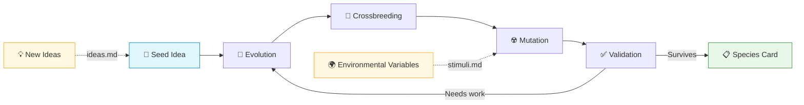
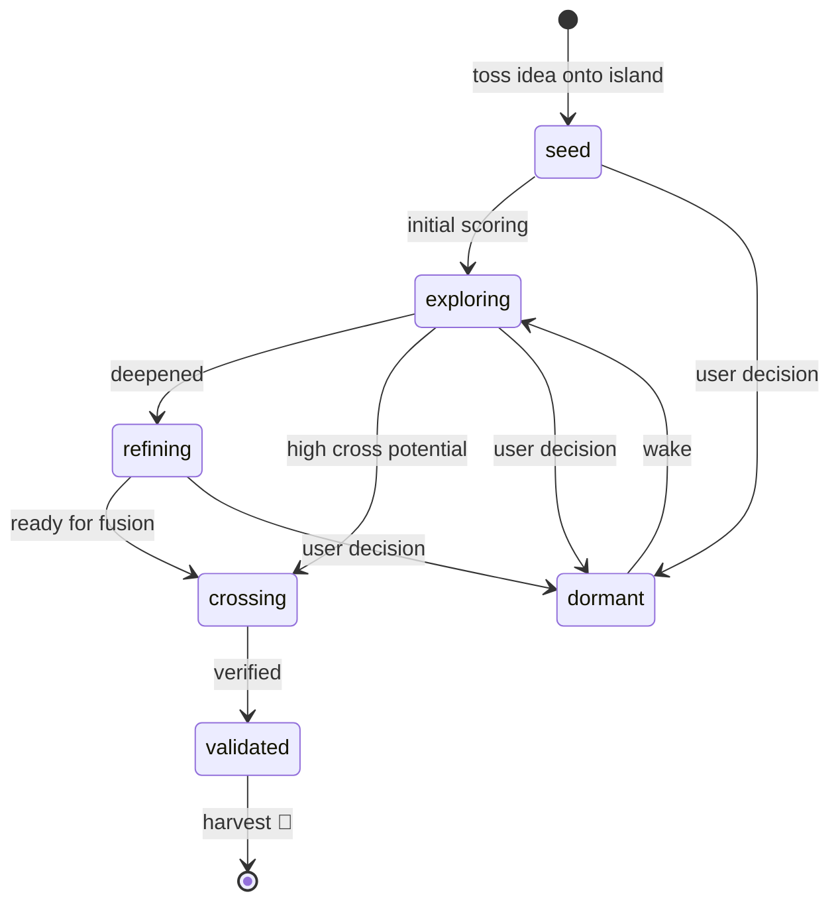

<div align="center">

# Idea Darwin

**An Evolution Island for Your Ideas**

[](LICENSE)
[](https://claude.ai)
[](#language-versions)

> You don't lack ideas. You lack a space where they evolve on their own.
> Deepening, crossbreeding, mutation — evolution's answers are always surprising, yet perfectly logical.

[中文版](README_ZH.md) | [日本語](README_JA.md)

</div>

---

## Table of Contents

- [What Happens on the Island](#what-happens-on-the-island)
- [Species Cards](#species-cards-every-idea-gets-its-own-file)
- [You Are the God of This Island](#you-are-the-god-of-this-island)
- [Scoring System](#scoring-system)
- [Quick Start](#quick-start)
- [All Commands](#all-commands)
- [Who Is This For](#who-is-this-for)
- [Installation](#installation)
- [Language Versions](#language-versions)

---

You're juggling multiple projects, you just read a great book, you had a fascinating conversation with a friend, a thought pops into your head on the commute home — ideas are scattered across every corner of your life. They don't only show up during scheduled brainstorming sessions. They appear anytime, anywhere — and vanish just as quickly.

**Idea Darwin gives you an island.** Your own evolution island.

Whenever a thought strikes, no matter how rough or fragmented, just toss it onto the island. Zero friction, no need to articulate it perfectly, no need to judge whether it's good. What happens next is the island's job.

## What Happens on the Island?

Your ideas are alive on this island. Like organisms, they follow three core laws of evolution:



### Evolution

Each round, the system identifies the most viable ideas and puts them through structured deep research — filling logical gaps, clarifying paths, identifying risks. Vague ideas become clear. Rough ideas become complete. Survival of the fittest — every idea gets stronger or gets left behind.

### Crossbreeding

Like biological reproduction. The system cross-pollinates your different ideas — a technical approach from work meets an observation from daily life, and they might produce a direction you never imagined. These cross-domain hybrids often yield the most valuable breakthroughs.

### Mutation

Beyond your own ideas, you can introduce "environmental variables" to the island — an industry headline, a theory you just learned, a conversation that struck a chord. These external stimuli trigger mutations in your ideas, spawning entirely new species that continue competing on the island.

## Species Cards: Every Idea Gets Its Own File

Every idea on this island — whether it's an original seed you tossed in, an offspring from crossbreeding, an evolved form after deepening, or a new species born from mutation — gets its own **species card**.

Each card records the idea's core question, full description, lineage, 6-dimensional scores, and change history. Starting from a handful of raw seeds and a few environmental variables, you'll end up with a rich, diverse island of species.

**These cards are what Idea Darwin ultimately produces.**

### Idea Lifecycle



### Example Species Card

| Field | Value |
|---|---|
| **ID** | IDEA-0001 |
| **Title** | Optimize Ideas with Evolutionary Theory |
| **Stage** | `validated` |
| **Novelty** | 9 |
| **Feasibility** | 9 |
| **Value** | 10 |
| **Logic** | 9 |
| **Cross Potential** | 10 |
| **Verifiability** | 8 |
| **Survival** | 9.10 |
| **Development** | 9.20 |
| **Priority** | 9.35 |

<details>
<summary>View full species card</summary>

```yaml
---
id: IDEA-0001
title: "Optimize Ideas with Evolutionary Theory"
status: active
stage: validated
round_created: 0
parent_ids: []
child_ids: [IDEA-0004, IDEA-0006, IDEA-0009]
tags: [meta, evolution, idea-management, creativity]
last_action: "validate"
last_round: 5
scores:
  novelty: 9
  feasibility: 9
  value: 10
  logic: 9
  cross_potential: 10
  verifiability: 8
  survival: 9.10
  development: 9.20
  priority: 9.35
---
```

**Core Question:** Can Darwin's natural selection — competition, crossbreeding, mutation — be applied to raw human ideas, letting them evolve into solutions no single brainstorm could produce?

**Full Description:** Most idea management tools are filing cabinets: they store ideas, tag them, and let them rot. This approach flips the paradigm entirely. Instead of organizing ideas, we let them *compete*. Every idea is a living species on an island. Each round, the fittest get deepened, different ideas cross-pollinate to produce unexpected hybrids, and external stimuli trigger mutations. The magic is in what you *didn't* plan — evolution surfaces directions that linear thinking never reaches. A technical architecture idea crosses with a behavioral psychology insight, and suddenly you have a product concept that neither domain would have produced alone.

**Current Tension:** How much randomness is too much? Pure natural selection can be slow; the system needs enough directed pressure to be useful within human timescales, while keeping enough chaos to produce genuine surprises.

**Directions for Further Deepening:**
- Calibrate the disruption frequency: too often = noise, too rare = local optima
- Explore whether users can define "fitness landscapes" — different evaluation criteria for different project contexts

**Cross Candidates:**
- IDEA-0003 (Spaced Repetition Learning System) — could evolved idea cards be fed into a spaced repetition loop, so the best insights stay top-of-mind?
- IDEA-0005 (Team Async Brainstorm Protocol) — multi-player evolution island where team members each contribute seeds and stimuli?

**Change Log:**
- Round 0: Original seed — "use evolution to manage ideas"
- Round 1: Deepened — formalized the three mechanisms (evolution, crossbreeding, mutation)
- Round 2: Crossed with IDEA-0002 (scoring systems) → produced 6-dimensional evaluation framework
- Round 3: Disruption round — external stimulus "Darwin's Finches adaptive radiation" triggered the species card concept
- Round 5: Validated — two-layer check passed, confirmed as viable product direction

</details>

## You Are the God of This Island

The system runs the evolutionary machinery, but you are always the sovereign. You can:

- **Score and judge** — decide which ideas deserve to keep evolving, which should hibernate
- **Intervene** — change the course of evolution at any moment, wake dormant species, introduce new stimuli
- **Harvest** — take mature idea cards off the island and put them to work in your projects, products, or life

The system only recommends. It never kills an idea without your say. Every life-or-death decision is yours.

## Scoring System

Each idea is evaluated across **6 dimensions** (1–10), then aggregated into three strategic layers:

### 6 Scoring Dimensions

| Dimension | Weight | What It Measures |
|---|---|---|
| **Novelty** | 10% | Is there a genuine breakthrough, or just repetition? |
| **Feasibility** | 20% | Is this technically and resource-wise achievable? |
| **Value** | 20% | How much impact would this create if successful? |
| **Logic** | 20% | Is it internally consistent, with no obvious gaps? |
| **Cross Potential** | 10% | Can it spark something new when combined with other ideas? |
| **Verifiability** | 20% | Can we design an experiment or minimum validation path? |

### Three-Layer Priority

| Layer | What It Captures |
|---|---|
| **Survival** | Standalone quality — can this idea survive on its own? |
| **Development** | Growth potential — how far can it still evolve? |
| **Priority** | Combined ranking with freshness and diversity corrections to prevent convergence |

<details>
<summary>Scoring formulas</summary>

```
Survival    = 0.10×Novelty + 0.20×Feasibility + 0.20×Value
              + 0.20×Logic + 0.10×CrossPotential + 0.20×Verifiability

Development = 0.30×Novelty + 0.30×CrossPotential
              + 0.20×VariationPotential + 0.20×Freshness

Priority    = 0.50×Survival + 0.30×Development
              + 0.10×NewIdeaBoost + 0.10×DiversityBonus
```

</details>

## Quick Start

### 1. Write your ideas

Create an `ideas.md` file — write as rough as you want:

```markdown
## Personal knowledge base that learns my style
I want a system that reads everything I write and gradually learns how I think,
so it can help me draft things in my own voice.

## Commute-to-podcast converter
Record voice memos during my commute, auto-convert them into structured podcast scripts.
```

### 2. Initialize your island

```
/idea-darwin init
```

The system generates a species card for each idea, with 6-dimensional scores and a three-layer priority ranking.

### 3. Start evolving

```
/idea-darwin round
```

Each round: evolution, crossbreeding, mutation, critique, and validation. After the round, you get a briefing — who rose, who fell, who's a new species, and what needs your decision.

### 4. Keep feeding the island

Append new ideas to `ideas.md`, add environmental variables to `stimuli.md`. They enter the next round automatically.

## All Commands

```
/idea-darwin init                    # Build the island
/idea-darwin round                   # Run one evolution round
/idea-darwin round 3                 # Run 3 consecutive rounds
/idea-darwin status                  # View species rankings
/idea-darwin dormant IDEA-0005       # Put a species into hibernation
/idea-darwin wake IDEA-0005          # Wake it up
```

<details>
<summary>init optional parameters</summary>

| Parameter | Description | Default |
|---|---|---|
| `--budget <N>` | Max species to process per round | `12` |
| `--actions <N>` | Max actions per species per round | `2` |
| `--disruption <N>` | Introduce environmental mutation every N rounds | `3` |

</details>

## Who Is This For?

- **People juggling multiple projects** — let thinking from different domains collide
- **People with lots of ideas that always stall** — give your ideas a place where they won't be forgotten
- **Solo creators and founders** — systematic direction-finding, even as a team of one
- **Researchers** — structured exploration of thesis topics and research directions
- **Anyone who thinks "I have so much in my head but can't sort it out"**

## Installation

> **Prerequisite:** [Claude Code](https://claude.ai), [OpenClaw](https://github.com/nicepkg/openclaw), or [Codex](https://github.com/openai/codex) must be installed.

```bash
# English version (global — available in all projects)
cp -r en/ ~/.claude/skills/idea-darwin/

# English version (project-level — this project only)
cp -r en/ .claude/skills/idea-darwin/
```

## Language Versions

| Version | Path | Description |
|---|---|---|
| English | `en/` | All prompts and templates in English |
| 中文版 | `zh/` | All prompts and templates in Chinese |
| 日本語 | `ja/` | All prompts and templates in Japanese |

<details>
<summary>File structure after initialization</summary>

```
project/
├── ideas.md          # Your raw ideas (read-only, the system never touches it)
├── config.yaml       # Island configuration and state
├── stimuli.md        # Environmental variables (maintained by you)
├── cards/            # Species cards
├── rounds/           # Evolution round reports
├── reports/          # Species leaderboard
└── graph/            # Species relationship graph
```

</details>

---

<div align="center">

MIT License

Made for [Claude Code](https://claude.ai)

</div>
