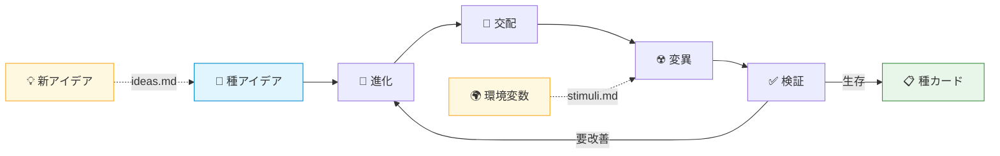
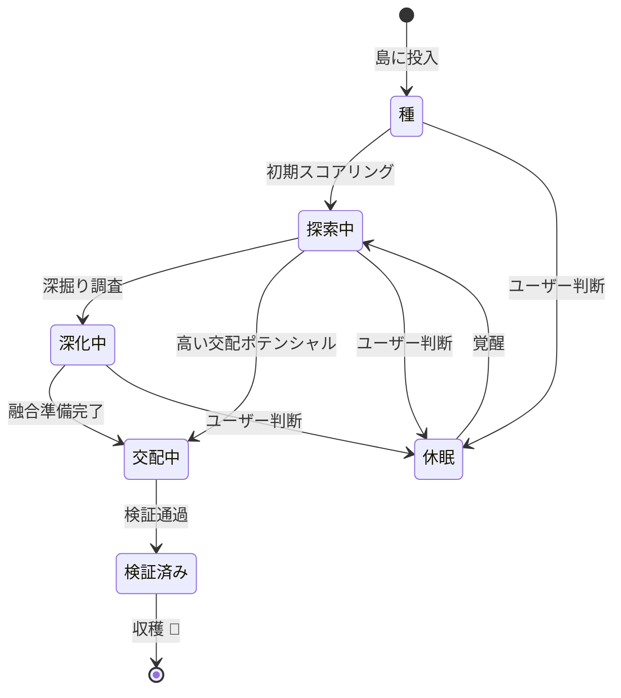

<div align="center">

# Idea Darwin

**あなたのアイデアに進化島を**

[](LICENSE)
[](https://claude.ai)
[](#言語バージョン)

> アイデアは足りている。足りないのは、それが勝手に進化する場所だ。
> 深化、交配、変異 —— 進化論の答えはいつも予想外で、それでいて完璧に理にかなっている。

[English](README.md) | [中文版](README_ZH.md)

</div>

---

## 目次

- [島で何が起きるのか](#島で何が起きるのか)
- [種カード](#種カードすべてのアイデアに専用ファイル)
- [あなたはこの島の神である](#あなたはこの島の神である)
- [スコアリングシステム](#スコアリングシステム)
- [クイックスタート](#クイックスタート)
- [全コマンド](#全コマンド)
- [誰のためのツールか](#誰のためのツールか)
- [インストール](#インストール)
- [言語バージョン](#言語バージョン)

---

複数のプロジェクトを同時に進め、面白い本を読み、友人と刺激的な会話をし、通勤中にふとアイデアが浮かぶ —— アイデアは生活のあらゆる場面に散らばっている。ブレインストーミングの時間だけに生まれるものではない。いつでもどこでも現れ、そしていつの間にか消えてしまう。

**Idea Darwin はあなたに島を与える。** あなた専用の進化島を。

思いつきが浮かんだら、どんなに荒削りで断片的でも、島に放り込むだけ。完璧に言語化する必要はない、良し悪しを判断する必要もない。あとは島が勝手にやってくれる。

## 島で何が起きるのか？

あなたのアイデアはこの島で生きている。生物のように、進化論の3つのコア法則に従う：



### 進化

各ラウンドで、システムは最も有望なアイデアを特定し、構造化された深掘り調査にかける —— 論理のギャップを埋め、パスを明確にし、リスクを特定する。曖昧なアイデアは明確になり、荒削りなアイデアは完成度が上がる。適者生存 —— すべてのアイデアはより強くなるか、取り残されるか。

### 交配

生物の繁殖のように。システムはあなたの異なるアイデア間で交配を行う —— 仕事の技術的アプローチが日常生活の観察と出会い、想像もしなかった新しい方向を生み出すかもしれない。こうした領域横断的なハイブリッドが、最も価値あるブレイクスルーを生むことが多い。

### 変異

あなた自身のアイデアに加え、島に「環境変数」を投入できる —— 業界ニュース、学んだばかりの理論、心に響いた会話。これらの外部刺激がアイデアに変異を引き起こし、まったく新しい種を生み出す。そしてそれらは島上で競争に参加し続ける。

## 種カード：すべてのアイデアに専用ファイル

この島のすべてのアイデア —— 最初に投げ込んだ生のアイデアも、交配で生まれた子孫も、深化後の進化形も、変異で生まれた新種も —— すべてに独自の**種カード**が与えられる。

各カードには、アイデアのコアクエスチョン、完全な説明、系譜、6次元スコア、変化の履歴が記録される。少数の生の種といくつかの環境変数から始めて、最終的には豊かで多様な種の島が手に入る。

**このカードこそが、Idea Darwin の最終成果物だ。**

### アイデアのライフサイクル



### 種カードの例

| フィールド | 値 |
|---|---|
| **ID** | IDEA-0001 |
| **タイトル** | 進化論の視点でアイデアを最適化する |
| **ステージ** | `validated` |
| **新規性** | 9 |
| **実現可能性** | 9 |
| **価値** | 10 |
| **論理性** | 9 |
| **交配ポテンシャル** | 10 |
| **検証可能性** | 8 |
| **Survival** | 9.10 |
| **Development** | 9.20 |
| **Priority** | 9.35 |

<details>
<summary>完全な種カードを表示</summary>

```yaml
---
id: IDEA-0001
title: "進化論の視点でアイデアを最適化する"
status: active
stage: validated
round_created: 0
parent_ids: []
child_ids: [IDEA-0004, IDEA-0006, IDEA-0009]
tags: [メタ, 進化論, アイデア管理, 創造性]
last_action: "validate"
last_round: 5
scores:
  novelty: 9
  feasibility: 9
  value: 10
  logic: 9
  cross_potential: 10
  verifiability: 8
  survival: 9.10
  development: 9.20
  priority: 9.35
---
```

**コアクエスチョン：** ダーウィンの自然選択 —— 競争、交配、変異 —— を人間の生のアイデアに適用し、どんなブレインストーミングでも到達できない解決策へと進化させることは可能か？

**完全な説明：** ほとんどのアイデア管理ツールはファイリングキャビネットだ：アイデアを保存し、タグを付け、そのまま腐らせる。このアプローチはパラダイムを完全にひっくり返す —— アイデアを整理するのではなく、*競争*させる。すべてのアイデアは島上の生きた種だ。各ラウンドで、最も適応力のあるものが深化され、異なるアイデア同士が交配して予想外のハイブリッドを生み、外部刺激が変異を引き起こす。魔法は*計画しなかった*部分にある —— 進化は、直線的な思考では決して到達できない方向を浮上させる。技術アーキテクチャのアイデアと行動心理学のインサイトが交配し、突然、どちらの領域単独では生み出せなかった製品コンセプトが誕生する。

**現在のテンション：** ランダム性はどこまでが適切か？純粋な自然選択は遅すぎる可能性がある。人間の時間スケールで有用であるために十分な方向付け圧力が必要だが、本当のサプライズを生み出すのに十分なカオスも保持しなければならない。

**さらなる深化の方向性：**
- 撹乱の頻度を調整：頻繁すぎる = ノイズ、稀すぎる = 局所最適
- ユーザーが「適応度ランドスケープ」を定義できるか探索 —— プロジェクトの文脈に応じた異なる評価基準

**交配候補：**
- IDEA-0003（間隔反復学習システム） —— 進化したアイデアカードを間隔反復ループに投入し、最良のインサイトを常にトップオブマインドに保てないか？
- IDEA-0005（チーム非同期ブレストプロトコル） —— チームメンバーがそれぞれ種と刺激を提供するマルチプレイヤー進化島？

**変更ログ：**
- ラウンド 0：元の種 —— 「進化論でアイデアを管理する」
- ラウンド 1：深化 —— 3つのメカニズム（進化、交配、変異）を形式化
- ラウンド 2：IDEA-0002（スコアリングシステム）と交配 → 6次元評価フレームワークを生成
- ラウンド 3：撹乱ラウンド —— 外部刺激「ダーウィンフィンチの適応放散」が種カードのコンセプトをトリガー
- ラウンド 5：検証通過 —— 二層チェックをパス、実行可能なプロダクト方向として確認

</details>

## あなたはこの島の神である

システムは進化のメカニズムを動かすが、主権者は常にあなただ。以下ができる：

- **評価と判断** —— どのアイデアが進化を続ける価値があり、どれを休眠させるべきかを決める
- **介入** —— いつでも進化の方向を変え、眠っている種を覚醒させ、新しい刺激を導入する
- **収穫** —— 成熟したアイデアカードを島から持ち出し、プロジェクト、製品、生活に投入する

システムは推奨するだけ。あなたの同意なくアイデアを淘汰することはない。すべての生死の決定はあなたが行う。

## スコアリングシステム

各アイデアは **6つの次元**（1〜10）で評価され、3つの戦略的レイヤーに集約される：

### 6つのスコアリング次元

| 次元 | 重み | 何を測るか |
|---|---|---|
| **新規性 Novelty** | 10% | 本当のブレイクスルーがあるか、それとも繰り返しか？ |
| **実現可能性 Feasibility** | 20% | 技術的・リソース的に達成可能か？ |
| **価値 Value** | 20% | 成功した場合のインパクトの大きさは？ |
| **論理性 Logic** | 20% | 内部的に一貫し、ギャップがないか？ |
| **交配ポテンシャル Cross Potential** | 10% | 他のアイデアと組み合わせて新しいものを生めるか？ |
| **検証可能性 Verifiability** | 20% | 実験や最小検証パスを設計できるか？ |

### 三層プライオリティ

| レイヤー | 何を捉えるか |
|---|---|
| **Survival** | 単独の品質 —— このアイデアは単体で生き残れるか？ |
| **Development** | 成長ポテンシャル —— まだどこまで進化できるか？ |
| **Priority** | 新鮮度と多様性補正を含む総合ランキング。収束を防止する |

<details>
<summary>スコアリング計算式</summary>

```
Survival    = 0.10×Novelty + 0.20×Feasibility + 0.20×Value
              + 0.20×Logic + 0.10×CrossPotential + 0.20×Verifiability

Development = 0.30×Novelty + 0.30×CrossPotential
              + 0.20×VariationPotential + 0.20×Freshness

Priority    = 0.50×Survival + 0.30×Development
              + 0.10×NewIdeaBoost + 0.10×DiversityBonus
```

</details>

## クイックスタート

### 1. アイデアを島に投入する

`ideas.md` ファイルを作成 —— どんなに荒削りでもOK：

```markdown
## 自分の文体を学習するパーソナルナレッジベース
自分が書いたものをすべて読み込み、自分の思考スタイルを徐々に学習して、
自分の言葉で下書きを手伝ってくれるシステムが欲しい。

## 通勤録音→ポッドキャスト変換
通勤中に音声メモを録り、構造化されたポッドキャスト台本に自動変換する。
```

### 2. 島を初期化する

```
/idea-darwin init
```

システムが各アイデアの種カードを生成し、6次元スコアと三層プライオリティランキングを付与する。

### 3. 進化を開始する

```
/idea-darwin round
```

各ラウンド：進化、交配、変異、批評、検証。ラウンド後にブリーフィングが届く —— 誰が上昇し、誰が下降し、誰が新種で、何があなたの判断を必要としているか。

### 4. 新しいアイデアと環境変数をいつでも追加

`ideas.md` に新しいアイデアを追記し、`stimuli.md` に環境変数を追加。次のラウンドで自動的に取り込まれる。

## 全コマンド

```
/idea-darwin init                    # 島を構築
/idea-darwin round                   # 進化を1ラウンド実行
/idea-darwin round 3                 # 3ラウンド連続実行
/idea-darwin status                  # 種のランキングを表示
/idea-darwin dormant IDEA-0005       # 種を休眠させる
/idea-darwin wake IDEA-0005          # 覚醒させる
```

<details>
<summary>init オプションパラメータ</summary>

| パラメータ | 説明 | デフォルト |
|---|---|---|
| `--budget <N>` | 1ラウンドあたりの最大処理種数 | `12` |
| `--actions <N>` | 各種の1ラウンドあたりの最大アクション数 | `2` |
| `--disruption <N>` | Nラウンドごとに環境変異を導入 | `3` |

</details>

## 誰のためのツールか？

- **複数プロジェクトを同時に進めている人** —— 異なる領域の思考を衝突させる
- **アイデアは多いがいつも頓挫する人** —— 忘れ去られない場所をアイデアに与える
- **個人クリエイター・起業家** —— 一人でも体系的な方向性の選別ができる
- **研究者** —— 論文テーマや研究方向の構造的な探索に
- **「頭の中にたくさんあるけど整理できない」と感じるすべての人**

## インストール

> **前提条件：** [Claude Code](https://claude.ai)、[OpenClaw](https://github.com/nicepkg/openclaw)、または [Codex](https://github.com/openai/codex) がインストールされている必要があります。

```bash
# 日本語版（グローバル —— すべてのプロジェクトで利用可能）
cp -r ja/ ~/.claude/skills/idea-darwin/

# 日本語版（プロジェクトレベル —— このプロジェクトのみ）
cp -r ja/ .claude/skills/idea-darwin/
```

## 言語バージョン

| バージョン | パス | 説明 |
|---|---|---|
| 日本語 | `ja/` | すべてのプロンプトとテンプレートが日本語 |
| English | `en/` | All prompts and templates in English |
| 中文版 | `zh/` | 所有提示词和模板均为中文 |

<details>
<summary>初期化後のファイル構造</summary>

```
project/
├── ideas.md          # あなたの生のアイデア（読み取り専用、システムは触れない）
├── config.yaml       # 島の設定と状態
├── stimuli.md        # 環境変数（あなたが管理）
├── cards/            # 種カード
├── rounds/           # 進化ラウンドレポート
├── reports/          # 種のリーダーボード
└── graph/            # 種の関係グラフ
```

</details>

---

<div align="center">

MIT License

Made for [Claude Code](https://claude.ai)

</div>
