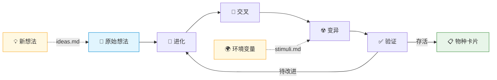
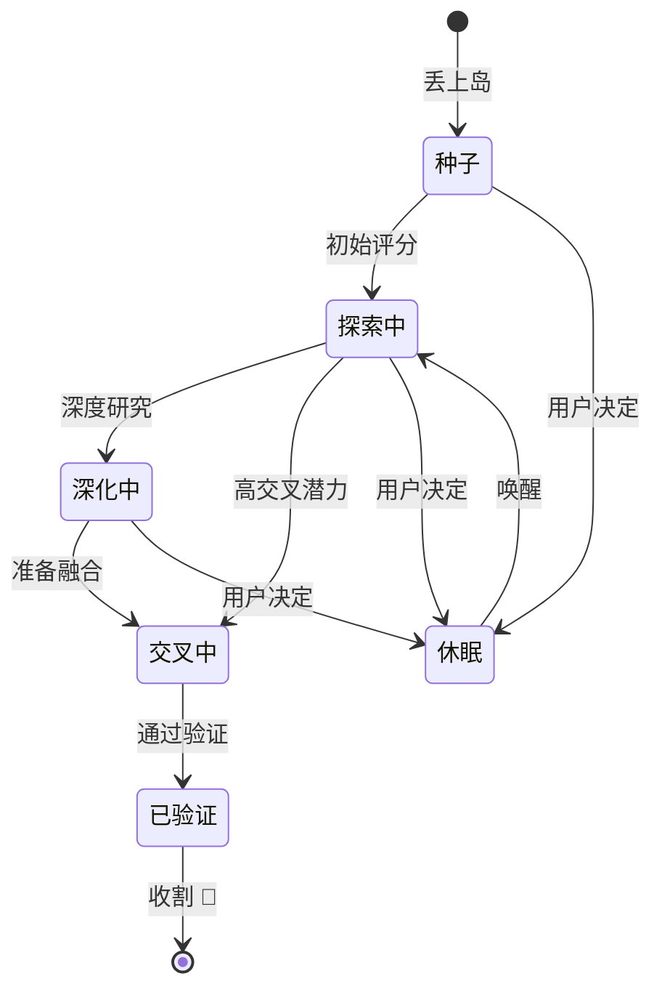

<div align="center">

# Idea Darwin

**给你的想法一座进化岛**

[](LICENSE)
[](https://claude.ai)
[](#语言版本)

> 你不缺 idea，你缺的是让它们自己进化的空间。
> 深化、交叉、变异 —— 进化论的答案总是出人意料，又无比合理。

[English](README.md) | [日本語](README_JA.md)

</div>

---

## 目录

- [岛上发生什么](#岛上发生什么)
- [物种卡片](#物种卡片每个想法都有自己的档案)
- [你是这座岛的上帝](#你是这座岛的上帝)
- [评分体系](#评分体系)
- [快速开始](#快速开始)
- [全部命令](#全部命令)
- [适合谁用](#适合谁用)
- [安装](#安装)
- [语言版本](#语言版本)

---

你同时在做好几个项目，读了一本好书，和朋友聊了一个有意思的话题，通勤路上突然冒出一个念头 —— 这些想法散落在生活的各个角落，不是坐下来"头脑风暴"才会产生的。它们随时随地出现，然后随时随地被遗忘。

**Idea Darwin 给你一座岛。** 一座属于你的进化岛。

任何时候冒出一个想法，不管多粗糙、多零碎，直接丢上岛。没有任何负担，不用写清楚，不用判断好坏。剩下的事情，岛上自会发生。

## 岛上发生什么？

你的想法在这座岛上是活的。它们像生物体一样，遵循进化论的三个核心法则：



### 进化

每一轮，系统会挑出最有生命力的 idea，对它们进行结构化的深度研究 —— 补齐逻辑、明确路径、识别风险。模糊的想法会变清晰，粗糙的会变完整。适者生存，每个 idea 都在变强。

### 交叉

就像生物体的繁衍。系统会在你的不同 idea 之间进行交叉融合 —— 一个来自工作的技术方案，遇上一个来自生活的观察，可能碰撞出你从未想过的新方向。这种跨领域的杂交，往往产生最有价值的突变。

### 变异

除了你自己的 idea，你还可以向岛上投放"环境变量" —— 一条行业新闻、一个刚学到的理论、一段让你有感触的对话。这些外部刺激会像辐射一样引发 idea 的变异，产生全新的物种，继续在岛上参与竞争。

## 物种卡片：每个想法都有自己的档案

这座岛上的每一个 idea —— 不管是你最初丢上来的原始想法，还是交叉产生的后代，深化后的进化体，或是变异催生的新物种 —— 都会拥有一张独立的 **物种卡片**。

每张卡片记录着这个 idea 的核心问题、完整描述、血统关系、6 维评分和变化轨迹。从少量的原始种子和几个环境变量开始，你最终会收获一座丰富的物种岛。

**而这些卡片，就是 Idea Darwin 的最终产出。**

### 想法生命周期



### 物种卡片示例

| 字段 | 值 |
|---|---|
| **ID** | IDEA-0001 |
| **标题** | 用进化论的角度做 idea 优化 |
| **阶段** | `validated` |
| **新颖性** | 9 |
| **可行性** | 9 |
| **价值** | 10 |
| **逻辑性** | 9 |
| **交叉潜力** | 10 |
| **可验证性** | 8 |
| **Survival** | 9.10 |
| **Development** | 9.20 |
| **Priority** | 9.35 |

<details>
<summary>查看完整物种卡片</summary>

```yaml
---
id: IDEA-0001
title: "用进化论的角度做 idea 优化"
status: active
stage: validated
round_created: 0
parent_ids: []
child_ids: [IDEA-0004, IDEA-0006, IDEA-0009]
tags: [meta, 进化论, 想法管理, 创造力]
last_action: "validate"
last_round: 5
scores:
  novelty: 9
  feasibility: 9
  value: 10
  logic: 9
  cross_potential: 10
  verifiability: 8
  survival: 9.10
  development: 9.20
  priority: 9.35
---
```

**核心问题：** 达尔文的自然选择 —— 竞争、交叉、变异 —— 能否直接应用于人类的原始想法，让它们进化出任何单次头脑风暴都无法产出的方案？

**完整描述：** 大多数想法管理工具都是文件柜：存想法、打标签、然后让它们烂在那里。这个方向彻底翻转了范式 —— 不是整理想法，而是让想法*竞争*。每个 idea 都是岛上的活物种。每一轮，最有生命力的被深化，不同的 idea 之间交叉授粉产生意想不到的杂交后代，外部刺激引发变异。魔力就在于你*没有计划*的部分 —— 进化能让线性思维永远到不了的方向浮现出来。一个技术架构想法和一个行为心理学洞察交叉，突然你就有了一个任何单一领域都不可能独立产出的产品概念。

**当前张力：** 随机性多少才合适？纯粹的自然选择可能太慢，系统需要足够的定向压力才能在人类时间尺度内有用，同时保留足够的混沌来制造真正的惊喜。

**进一步深化方向：**
- 校准扰动频率：太频繁 = 噪音，太稀少 = 局部最优
- 探索用户能否定义"适应度景观" —— 不同项目场景使用不同的评估标准

**交叉候选：**
- IDEA-0003（间隔重复学习系统） —— 进化后的 idea 卡片能否接入间隔重复循环，让最好的洞察始终保持在大脑前台？
- IDEA-0005（团队异步头脑风暴协议） —— 多人进化岛，团队成员各自贡献种子和刺激？

**变更日志：**
- 第 0 轮：原始种子 —— "用进化论管理想法"
- 第 1 轮：深化 —— 形式化了三大机制（进化、交叉、变异）
- 第 2 轮：与 IDEA-0002（评分系统）交叉 → 产出 6 维评估框架
- 第 3 轮：扰动轮 —— 外部刺激"达尔文雀的适应辐射"触发了物种卡片概念
- 第 5 轮：验证通过 —— 两层检查均通过，确认为可行的产品方向

</details>

## 你是这座岛的上帝

系统负责运转进化机制，但你始终是这座岛的主宰。你可以：

- **打分和判断** —— 评估哪些 idea 值得继续进化，哪些该休眠
- **干预** —— 在任何时刻改变进化方向，唤醒沉睡的物种，引入新的刺激
- **收割** —— 把成熟的 idea 卡片带出岛屿，投入到你的项目、产品或生活中

系统只推荐，不擅自淘汰任何想法。每一个生死决定，都由你来做。

## 评分体系

每个 idea 从 **6 个维度**（1–10 分）评估，汇总为三层战略优先级：

### 6 个评分维度

| 维度 | 权重 | 衡量什么 |
|---|---|---|
| **新颖性 Novelty** | 10% | 是否有真正的突破，还是在重复？ |
| **可行性 Feasibility** | 20% | 技术上和资源上是否可实现？ |
| **价值 Value** | 20% | 如果成功，能创造多大影响？ |
| **逻辑性 Logic** | 20% | 内在是否自洽，有没有明显漏洞？ |
| **交叉潜力 Cross Potential** | 10% | 与其他 idea 结合时能否碰撞出新东西？ |
| **可验证性 Verifiability** | 20% | 能否设计一个实验或最小验证路径？ |

### 三层优先级

| 层级 | 衡量什么 |
|---|---|
| **Survival** | 这个 idea 本身的质量 —— 能不能独立活下来？ |
| **Development** | 它的成长空间 —— 还能进化多远？ |
| **Priority** | 综合评估 —— 加入新鲜度和多样性修正，防止物种趋同 |

<details>
<summary>评分公式</summary>

```
Survival    = 0.10×Novelty + 0.20×Feasibility + 0.20×Value
              + 0.20×Logic + 0.10×CrossPotential + 0.20×Verifiability

Development = 0.30×Novelty + 0.30×CrossPotential
              + 0.20×VariationPotential + 0.20×Freshness

Priority    = 0.50×Survival + 0.30×Development
              + 0.10×NewIdeaBoost + 0.10×DiversityBonus
```

</details>

## 快速开始

### 1. 把想法丢上岛

创建一个 `ideas.md` 文件，写多粗糙都行：

```markdown
## 能学习我写作风格的个人知识库
我想要一个系统，读我写过的所有东西，逐渐学会我的思考方式，
然后用我自己的语感帮我起草内容。

## 通勤录音转播客
通勤路上录语音备忘，自动转成结构化的播客脚本。
```

### 2. 初始化你的岛

```
/idea-darwin init
```

系统为每个想法生成物种卡片，包含 6 维评分和三层优先级分数。

### 3. 开始进化

```
/idea-darwin round
```

每一轮，系统自动执行进化、交叉、变异、批判和验证。轮次结束后，你会收到一份简报：谁升了、谁降了、谁是新物种、谁需要你拍板。

### 4. 随时加入新想法和环境变量

往 `ideas.md` 里追加新 idea，往 `stimuli.md` 里追加环境变量。下一轮自动纳入进化。

## 全部命令

```
/idea-darwin init                    # 建岛
/idea-darwin round                   # 跑一轮进化
/idea-darwin round 3                 # 连续跑 3 轮
/idea-darwin status                  # 看物种排名
/idea-darwin dormant IDEA-0005       # 让某个物种休眠
/idea-darwin wake IDEA-0005          # 唤醒它
```

<details>
<summary>init 可选参数</summary>

| 参数 | 说明 | 默认值 |
|---|---|---|
| `--budget <N>` | 每轮最多处理的物种数 | `12` |
| `--actions <N>` | 每个物种每轮最多执行的动作数 | `2` |
| `--disruption <N>` | 每 N 轮引入一次环境变异 | `3` |

</details>

## 适合谁用？

- **同时推进多个项目的人** —— 让不同项目的思考互相碰撞
- **想法很多但总是搁浅的人** —— 给想法一个不会被遗忘的去处
- **独立创作者和创业者** —— 一个人也能做系统化的方向筛选
- **研究者** —— 在论文选题和研究方向中做结构化探索
- **任何觉得"我脑子里东西很多但理不清"的人**

## 安装

> **前置条件：** 需要先安装 [Claude Code](https://claude.ai)、[OpenClaw](https://github.com/nicepkg/openclaw) 或 [Codex](https://github.com/openai/codex)。

```bash
# 中文版（全局 —— 在所有项目中可用）
cp -r zh/ ~/.claude/skills/idea-darwin/

# 中文版（项目级别 —— 仅当前项目）
cp -r zh/ .claude/skills/idea-darwin/
```

## 语言版本

| 版本 | 路径 | 说明 |
|---|---|---|
| 中文版 | `zh/` | 所有提示词和模板均为中文 |
| English | `en/` | All prompts and templates in English |
| 日本語 | `ja/` | すべてのプロンプトとテンプレートが日本語 |

<details>
<summary>运行后的文件结构</summary>

```
project/
├── ideas.md          # 你的原始想法（只读，系统不会碰它）
├── config.yaml       # 岛的配置与状态
├── stimuli.md        # 环境变量（你来维护）
├── cards/            # 物种卡片
├── rounds/           # 每轮进化报告
├── reports/          # 物种排行榜
└── graph/            # 物种关系图谱
```

</details>

---

<div align="center">

MIT License

Made for [Claude Code](https://claude.ai)

</div>
